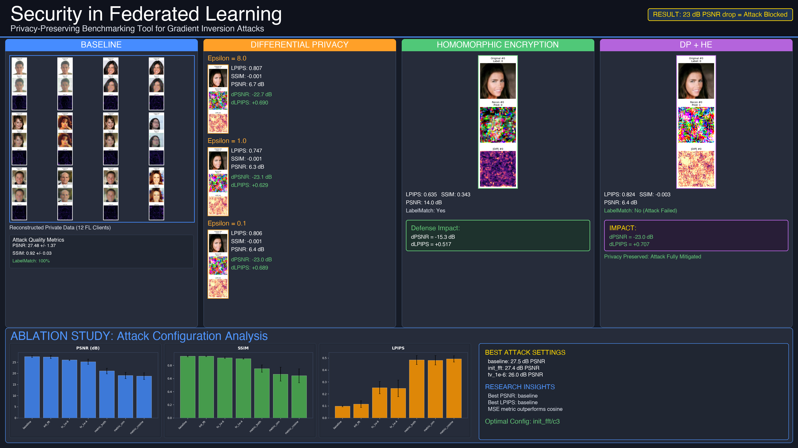

# Security in Federated Learning: Gradient Inversion, Ablations, and Defenses

[](https://python.org) [](https://pytorch.org) [](https://github.com/imaddde867/FL-Attack) [](https://github.com/imaddde867/FL-Attack)

[](https://imaddde867.github.io/FL-Attack/) [](https://imaddde867.github.io/FL-Attack/)

> **[🔗 View Online Dashboard →](https://imaddde867.github.io/FL-Attack/)**



**What this shows**
- Baseline gradient leakage produces recognizable reconstructions on CelebA.
- Ablations (TV, metric choice, FFT init) materially affect attack quality across clients.
- In this setup, DP and HE—especially combined—degrade reconstructions, confirmed by metrics and visuals.

**Quickstart Demo**
- Generate report (aggregates metrics, writes `results/report/summary.csv`)
  - `python scripts/make_poster.py`
- Generate poster (4K PNG/PDF)
  - `python scripts/make_poster.py`
- Launch dashboard (static)
  - `python -m http.server --directory results/report 8000`
  - Visit http://localhost:8000

Optional: produce fresh results before summarizing
- Showcase (single best visual): `bash scripts/run_showcase.sh`
- Multi‑client benchmark: `bash scripts/run_multi_client.sh`
- Defenses sweep (DP/HE/DP+HE): `bash scripts/run_defenses.sh`

**Results at a Glance**
Pulled from `results/report/summary.csv`.
- Baseline (no defense): 29.38 dB PSNR, 0.117 LPIPS
- DP + HE (combined): 6.37 dB PSNR, 0.824 LPIPS
- Multi‑client spread (10 clients): best 29.51 → worst 24.91 dB PSNR

See the aggregated CSV at `results/report/summary.csv`. The poster above visualizes: baseline grid (best reconstructions), DP variants, HE, and DP+HE side‑by‑side, plus ablation highlights.

**Reproducible Pipeline**
```
data -> scripts/run_* (showcase / multi_client / defenses)
     -> per-run outputs: results/*/metrics.txt + baseline_attack_result.png
     -> make_report: results/report/summary.csv (via scripts/make_poster.py)
     -> make_poster: results/report/poster_4k.png (and poster_4k.pdf)
     -> make_dashboard: serve results/report via http.server
```

**Repository Layout**
- `scripts/`
  - `run_showcase.sh`, `run_multi_client.sh`, `run_defenses.sh`
  - `analyze_multi_client.py`, `analyze_defenses.py`, `analyze_ablation.py`
  - `make_poster.py` (aggregates metrics, writes `summary.csv`, renders `poster_4k.png`)
- `results/`
  - `report/` (poster + `summary.csv`)
  - `showcase/`, `multi_client/`, `defenses/`, `ablation/` (per‑run images and `metrics.txt`)
- Core
  - `run_experiment.py`, `fl_system.py`, `gradient_attack.py`
  - `Differential_privacy.py`, `homomorphic_encryptor.py`, `device_utils.py`
- Data (expected)
  - `data/img_align_celeba/`, `data/list_attr_celeba.csv`, `data/list_eval_partition.csv`

**Notes / Limitations**
- Findings are specific to this dataset and configuration; interpret as “observed in this setup,” not general privacy guarantees.
- DP/HE implementations are research-grade; parameters are chosen to demonstrate qualitative/quantitative effects, not deployment guidance.
- Metrics sometimes include negative SSIM under heavy noise—this reflects the measurement on extremely degraded reconstructions.

Outputs referenced
- Hero poster: `results/report/poster_4k.png` (PDF also: `results/report/poster_4k.pdf`)
- Metrics summary: `results/report/summary.csv`
- Showcase visual: `results/showcase/baseline_attack_result.png`
