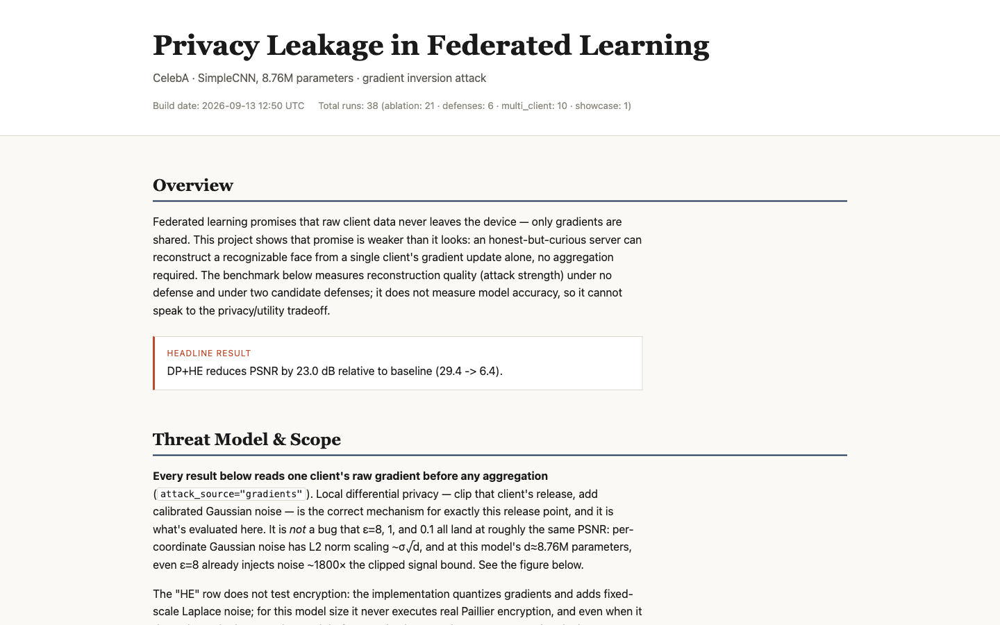

# Privacy Leakage in Federated Learning

[](https://python.org)
[](https://pytorch.org)
[](LICENSE)

> **[🔗 Live Dashboard](https://imaddde867.github.io/FL-Attack/)**

A benchmark for gradient inversion attacks in federated learning, and for the defenses that are supposed to stop them. Built together with [Ritesh Bhandari](https://github.com/Riteshbhandarii).



## Key Findings

Every number below comes straight out of `results/report/summary.csv`.

| Configuration | PSNR (dB) | LPIPS ↓ |
|---|---|---|
| Baseline (no defense) | 29.38 | 0.117 |
| DP, local, ε=8 | 6.71 | 0.807 |
| DP, local, ε=1 | 6.32 | 0.747 |
| DP, local, ε=0.1 | 6.36 | 0.806 |
| "HE" (quantize + fixed noise; see caveat below) | 14.03 | 0.635 |
| DP (ε=1) + "HE" | 6.37 | 0.824 |

- Baseline attacks reconstruct recognizable faces from a single client's
  raw gradient.
- The DP mechanism above is correctly implemented local DP. It clips
  and noises one client's own gradient before release, which is the right
  mechanism for the threat model tested here (an adversary reading a
  single pre-aggregation update). It is *not* a bug that ε=8/1/0.1 all land
  at roughly the same PSNR: per-coordinate Gaussian noise has L2 norm
  scaling ~σ√d, and at this model's d≈8.76M parameters, even ε=8 already
  injects noise ~1800× the clipped signal bound. The chosen ε range simply
  couldn't have shown graduated protection at this dimensionality; see
  `results/report/figures/dp_noise_scaling.png` and
  `scripts/dp_noise_scaling_proof.py` for the worked-out proof.
- The "HE" row does not test encryption. The implementation quantizes
  gradients and adds a fixed-scale Laplace noise term; at this model size
  it never executes real Paillier encryption, and even when it does, the
  code decrypts the result before scoring it. A real HE/secure-aggregation
  deployment would never hand a decrypted intermediate to the attacker
  this project simulates. The honest version of that experiment is
  implemented but unevaluated: `fl_system.py`'s
  `capture_mode='agg_update'`, paired with `differential_privacy.
  aggregate_clipped_noisy`'s central-DP mechanism, attacking only the
  FedAvg-averaged update, which is what a curious aggregator actually sees
  under real secure aggregation. Running it needs GPU/CelebA compute that
  was unavailable this cycle, so it stays a stated limitation on the scope
  of these numbers.
- This benchmark measures attack quality only. It leaves model accuracy
  under each defense unmeasured, so it says nothing about the
  privacy/utility tradeoff.

## Quick Start

```bash
# Install dependencies
pip install -r requirements.txt

# Run showcase experiment
bash scripts/run_showcase.sh

# Launch local dashboard
python -m http.server --directory docs 8000
```

## Project Structure

```text
├── run_experiment.py          # Main experiment runner
├── fl_system.py               # Federated learning simulation
├── gradient_attack.py         # DLG/iDLG attack implementation
├── differential_privacy.py    # Gaussian mechanism for DP
├── homomorphic_encryptor.py   # Paillier-like HE
├── device_utils.py            # Auto device detection
├── scripts/                   # Experiment & analysis scripts
├── results/                   # Experiment outputs
│   └── report/                # Generated reports & dashboard
├── docs/                      # GitHub Pages dashboard
└── data/                      # CelebA dataset (not included)
```

## Experiments

| Script | Description |
|--------|-------------|
| `run_showcase.sh` | Single high-quality attack demo |
| `run_multi_client.sh` | Benchmark across 10 clients |
| `run_defenses.sh` | DP/HE defense evaluation |
| `run_ablation.sh` | Attack hyperparameter study |

## Usage

```bash
# Basic attack (no defense)
python run_experiment.py --attack-iterations 3000

# With differential privacy
python run_experiment.py --dp-epsilon 1.0

# With homomorphic encryption
python run_experiment.py --use-he

# Combined defenses
python run_experiment.py --dp-epsilon 1.0 --use-he
```

See `python run_experiment.py --help` for all options.

## Requirements

- Python 3.8+
- PyTorch 2.0+
- CelebA dataset in `data/`

## Notes

- Results hold for this experimental setup only (single-client gradient
  leak, 8.76M-parameter model, CelebA 64×64).
- The DP/HE implementations here are research-grade and should stay well
  away from production.
- The dashboard carries the detailed visualizations.
